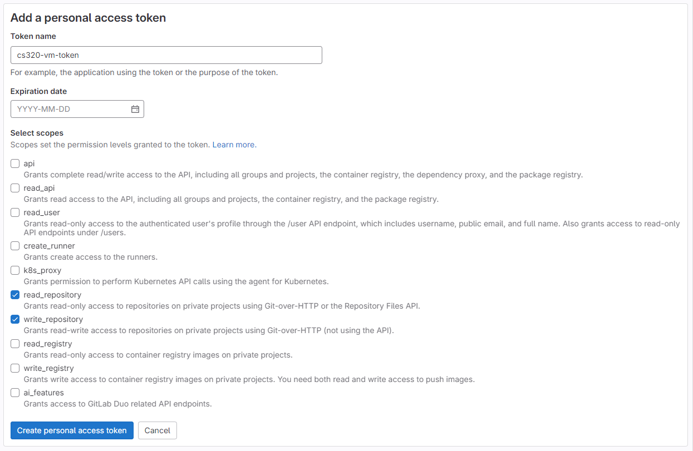

# Git Workflows for CS 320

This document serves as a resource for common git workflows that we will be using
throughout the semester in CS 320. Each section will provide a detailed overview
of the git workflow and is followed by a "quick commands" section which gives you
the commands to run in case you need a quick refresh.

It is recommended that you read the long version **at least once** so that you
understand what each command is doing. We will be using these commands a lot this
semester, so being comfortable with what they do will make the course material
more manageable.

# Contents

- [Git Workflows for CS 320](#git-workflows-for-cs-320)
- [Contents](#contents)
  - [Getting started with your VM](#getting-started-with-your-vm)
    - [Creating a personal access token with GitLab](#creating-a-personal-access-token-with-gitlab)
    - [Getting the machine projects and labs files on your VM](#getting-the-machine-projects-and-labs-files-on-your-vm)
  - [Starting a machine project](#starting-a-machine-project)
    - [Quick commands (starting)](#quick-commands-starting)
  - [Working on a machine project](#working-on-a-machine-project)
    - [Quick commands (working)](#quick-commands-working)
  - [Submitting a machine project](#submitting-a-machine-project)
    - [Quick commands (submitting)](#quick-commands-submitting)

---

## Getting started with your VM

### Creating a personal access token with GitLab

To begin, we will need to create a personal access token that will allow us to interact
with GitLab and make changes and push/pull them from our local repository.

Follow these steps:

1. Login to the [UW - Madison GitLab](https://git.doit.wisc.edu/users/sign_in) using your
UW - Madison NetID. Make sure you use the NetID login button instead of entering your 
username/email.
2. Once logged in, click on your user icon, and then edit profile


3. After this, click on "Access Tokens" on the left sidebar, and then click "Add new token".
4. You can set the token name to be whatever you want it to be, though we recommend something
descriptive (i.e. cs320-vm-token) just in case you need to create multiple for different devices. 
Set the expiration date to be after the final exam (that way you only need one token for the entire 
semester), and check the boxes for `read_repository` and `write_repository`. Now you can click
"Create personal access token":



**IMPORTANT**: Make sure that you copy the personal access token and paste it into a Google Doc,
Word Doc, sticky note, or some other location on your computer so that you can access it later.
We wil be using it each time we want to pull/push files.


You have now successfully created a personal access token for using GitLab this semester! We will
now use this below to get the class project, lecture, and lab files onto our VM.

### Getting the machine projects and labs files on your VM

Before starting with this section, make sure that you have followed the virtual machine
setup instructions from [Lab 1](../labs/Lab1/lab1.md), otherwise these commands may not work.
Additionally, make sure you followed the 
[Creating a personal access token with GitLab](#creating-a-personal-access-token-with-gitlab)
section above, or else this section will not work.

After setting up your VM, you can SSH into your VM using `ssh USERNAME@IP_ADDRESS` with
the username used for your VM, and the external IP address found in the 
[Google Cloud Console](https://console.cloud.google.com/).

Once you have have an SSH session created, follow the following steps to get the machine projects and
labs repository setup on your VM:

1. Login to GitLab. If you click on the orange fox GitLab logo in the top left corner, you will be taken
to the homepage. Click on the repository for the CS 320 files. It should be called something like
`cs320-SEMESTER-projects-and-labs`.
1. Once you are in there, click on "Code", and then copy the URL for "Clone with HTTPS":


3. Now, if you go to your VM terminal (make sure you have SSH'ed into your VM), run the following command:
`git clone HTTPS-URL-FROM-GITLAB` where "HTTPS-URL-FROM-GITLAB" is the URl that you copied in the previous step.
You will be prompted for your username (use your wisconsin NetID username i.e. the part before "@wisc.edu"), and then it will ask you for your password. **IMPORTANT**: When entering your password, you will 
**use your personal access token** that we created. **DO NOT** use your actual UW NetID password, or else this 
will not work.
4. Once this finished running, you can run ls, and you should the the course files in a new directory on your VM. If you want to change the name of the directory, run `mv OLD_NAME NEW_NAME` to change the name. For example, if we wanted
to rename our directory from `cs320-SEMESTER-projects-and-labs` to `cs320`, we would run 
`mv cs320-SEMESTER-projects-and-labs cs320`.

You have now successfully cloned the class materials to your VM!

---

## Starting a machine project

When you are first beginning a new machine project, it is important to make sure
that you have the most up-to-date version of the machine project resources (tester, key, README, etc.).
First make sure that you are in the git repository for this class (not your home).
Next, we will run `git checkout main` to get to our main branch.

Once we are on our main branch, we need to pull any files from the remote
GitLab repository to our local version of the repository. We can do this by
running `git pull`. After doing this we will see `Already up to date` if nothing
is new, or we will see a list of all of the new changes that we pulled.

At this point, the new resources are present on our main branch, but not our machine project
branch. To get these resources onto our machine project branch, we first need to switch
to that branch. We can do this by running `git checkout MP#` for the proper machine project
number in place of "#". After this, we should see `Switched to branch 'MP#'` which 
means we were able to successfully change branches. If you see something else, you 
may need to stop by office hours to debug it (or try looking it up online).

Now that we have switched branches, we need to merge the new resources from the main
branch into our machine project branch. To do this, we run `git merge main`, which will merge
the changes from the main branch into the machine project branch. At this point, we should be
able to run `ls` and see that the new resources are now present on our machine project branch.

### Quick commands (starting)

Getting updated files:

```shell
git checkout main
git pull
git checkout MP#
git merge main
ls
```

---

## Working on a machine project

While working on your machine project, we will recommend that you make commits as you go.
This will ensure that you have backups for your work in case you have VM troubles
at any point throughout the semester. This could mean committing each time you 
finish a question on a machine project, though a more realistic workflow may involve
committing only after each section of a machine project.

To begin, make sure that you have followed the steps above in [starting a machine project](#starting-a-machine-project) to ensure that that you have the newest version of resources
on your machine project branch.

Now that we have the newest version of files, let's ensure that we are on our machine project
branch. We can run `git branch` to make sure that we are on the "MP#" branch for our
current machine project.

After that, let's see what files are currently ready to be committed. If you run `git status`, 
you will see a list of filepaths that are red. Most of the time, these files are currently 
**not** being tracked, are currently **not** staged for commit (which means they are 
tracked but not going to be "saved" in our next commit), or are unmerged (which means
that there is a merge conflict and we need to fix it).

In this list of red files, we should see one of the required files that we changed. For
example, if we are just starting machine project 1, it is likely that we will see `mp1.ipynb` under
the section for "Untracked files". We need to tell git that we want to track the changes
that are made to this file. To do this, we run `git add FILENAME1 FILENAME2 ...`. Going 
back to our example, we would run `git add mp1.ipynb`. This will tell git that `mp1.ipynb` 
is a file that we want to track and include in our next commit.

If we run `git status` again, we should see that `mp1.ipynb` is now green and under the list
for "Changes to be committed". If we have other files to add, we can do that now. Once
we have added all of the files that we wanted to commit, we can commit them by running
`git commit -m "COMMIT MESSAGE HERE"`. For example, if we just finished part 1 of machine project 1,
we may run this command: `git commit -m "Completed part 1 of machine project 1. Passing tester."`.

After running this commit command, our code has been committed to our local repository. To
make our changes visible on GitLab, we will need to push these chnages from our
local repository to the remote GitLab repository. To do this, we run `git push`. Now,
if you go to GitLab and change to the correct machine project branch, your changes should now be visible.

### Quick commands (working)

Pushing updated files to GitLab:

```shell
git branch
git status # optional
git add FILENAME1 FILENAME2 ...
git status # optional
git commit -m "COMMIT MESSAGE HERE"
git push
```

---

## Submitting a machine project

To begin, make sure that you have followed the steps above in [starting a machine project](#starting-a-machine-project) to ensure that that you have the newest version of resources
on your machine project branch.

Each machine project may have a different requirement for which files you must submit. For example, many machine projects will require you to submit just a notebook (.ipynb extension), while some will require that you submit pictures, Python files (.py extension), or HTML files. As such, we have tried to provide a list of what you need to submit at the beginning of each machine project README.

Once you have all of the required files prepared, follow the instructions in [working on a machine project](#working-on-a-machine-project) to get all of your files pushed to GitLab.

After making sure that all of your files are present on GitLab, all that is left to submit 
your machine project is to make a merge request from your machine project branch into your main branch.

1. On the left sidebar, select "Merge requests". Once there, select "New merge request".
2. We want to make the merge request from the machine project branch we are working on (MP1 branch in this example) into
the main branch of our private repo. The branches are shown below circled in red, while the private branch will
be in the blue circle. Make sure that you **do not** make the merge request to the public repo, or it will
not be graded.


3. Once you get to the merge request options page, make sure that "Mark as draft" is **not** checked, and also
scroll down and uncheck "Delete source branch when merge request is accepted.". You can now create the merge 
request.
4. After you create the merge request, you can check your score on the autograder. To do so, first go to GitLab, 
and then go to the left sidebar and select "Merge Requests". Once there, select the project that you want to 
check the results for, and then select the "Pipelines" tab.


5. Now, from the "Pipelines" tab, you can see all of the associated autograder runs with this specific merge
request that you just created. If we wanted to check the score of one of these jobs, we can click on the colored
symbol (in this case it says "Passed", but it could also say "Failed", "Pending", or "Cancelled"). **Note** just 
because it says "Passed" here **does not** mean that your submission is passing. It just means that the 
autograder was able to successfully grade your submission. After this, just press on the name of the job, which
should be something like "mp#" for the proper machine project number.


6. Finally, from here you can see what score the autograder assigned to you. In the example here, we can see
that we passed with 100% on MP1!


### Quick commands (submitting)

Pushing updated files to GitLab:

```shell
git branch
git status # optional
git add FILENAME1 FILENAME2 ...
git status # optional
git commit -m "COMMIT MESSAGE HERE"
git push
```