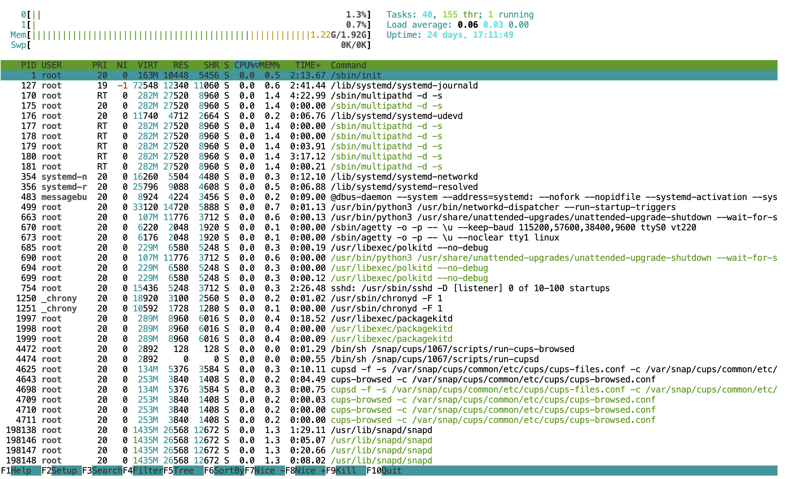
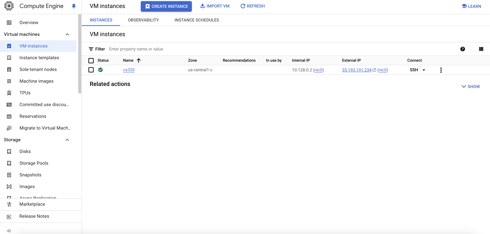
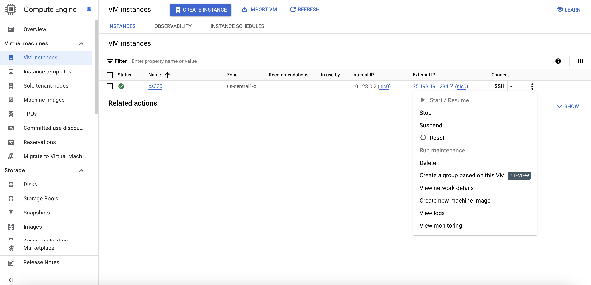
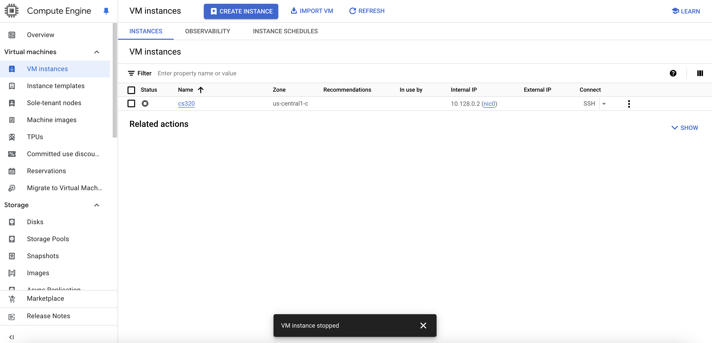
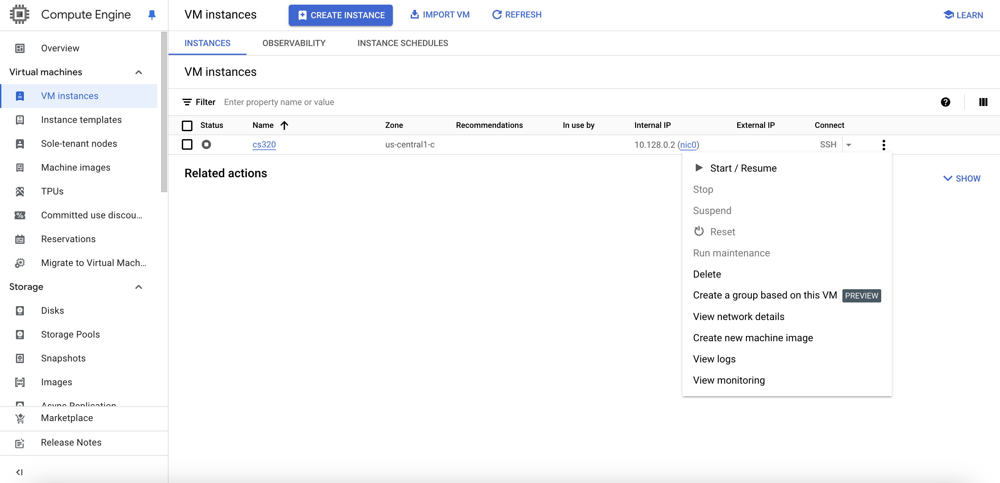

# Google Option for Virtual Machine

## Step 1: Create Account and Redeem Credits

Follow [these instructions](gcp.md) to create an account and redeem the credit.

## Step 2: Configuring the Firewall

Follow [these instructions](firewall.md) to configure the firewall to unblock all
ports.

## Step 3 [Recommended]: Creating an SSH Key

You already have an idea of what a shell is: you've been either using
PowerShell (Windows) or bash (default on Mac) in CS 220/301.  *ssh*
stands for "secure shell", and it's a special shell that lets you
remotely connect to other computers over the network and run commands
there.  An *ssh key* is like a randomly generated password that ssh
automatically uses to access other machines (you won't generally type
it).

Macs and recent Windows computers (Windows 10 with recent updates)
should have a program OpenSSH installed, which will be the most
convenient way to access your virtual machine.

Try [these directions](ssh.md) to create an SSH key and connect it
with your cloud account.  If it doesn't work (e.g., because you don't
have OpenSSH), don't worry too much -- there are workarounds later.

## Step 4: Launching your Virtual Machine

Now it's time to actually create your virtual machine!  Follow [these steps](launch.md).

## Step 5a: Connecting with SSH from your terminal

If you were able to configure the SSH key properly in Step 3, follow
[these directions](connect.md).

## Step 5b [Alternative]: Connecting without SSH

Please only consider following [these
directions](connect-alt.md) if you couldn't configure the SSH key. Using this option may 
cause problem in the long run. 

## Step 6: Setting up Jupyter

Now lets get Jupyter and some other software installed.  Follow [these
directions](jupyter.md).

## **Note:** How to Stop and Start your VM

**Note:** This isn't necessary right now but might be useful as a reference throughout the semester.

**Important: Before you begin this process, make sure to save all your progress by pushing it to your Git repository. If you are unsure how to do this, refer to the [git-workflows](../../../../git-workflows/README.md) document for guidance.**

Throughout the semester, you might run out of RAM on your VM. RAM (Random Access Memory) is different from the persistent storage (disk space) on your VM, which is much larger. RAM is the memory used to run programs and handle active processes on your VM, while storage is where files and data are saved permanently.

Running out of RAM can happen for multiple reasons, such as running large programs or running them for extended periods, as they can accumulate data in memory. In our case, the most common reason for running out of RAM is Jupyter Notebook. While it is constantly running to maintain the SSH tunnel to your browser, it accumulates a large amount of metadata, which can consume significant memory over time.

To check how much memory (RAM) you have left on your VM, run the command `htop` in the terminal. You will see an output similar to this:  

At the top, look for the bar labeled **"Mem"**. If you notice this bar is nearly full, it might be a good time to stop and restart your VM. In the example above, the memory usage is almost at its limit.

**Note:** Stopping your VM will terminate all processes running on it. If you have active processes, stopping the VM could result in data loss or corruption. **Make sure to save your work before proceeding.**

### Steps to Stop and Resume Your VM

1. Open your browser and go to **Google Cloud > Console > Compute Engine > VM Instances**.
2. Locate your VM under "VM Instances."



3. Click on the three vertical dots next to your VM.



4. Select **"Stop"** from the dropdown menu.
5. You will see a warning about potential data loss. Confirm by clicking **"Stop"** again.

Wait a few minutes for your VM to shut down. You can monitor its status under the "Status" column.



Once it shows **Stopped**:

6. Click on the three vertical dots again and select **"Start/Resume."**  



**Note:** After restarting, your VM will have a new external IP address. You will need this updated IP to SSH into your VM.

### Reconnecting and Restarting JupyterLab

Once your VM is running again:

1. SSH into your VM using the new external IP.
2. Run the following commands to restart JupyterLab:

```bash
python3 -m jupyterlab password
```

```bash
nohup python3 -m jupyterlab --no-browser --ip=0.0.0.0 --port=2020 &
```

3. Open your browser and use the new IP address to access JupyterLab.