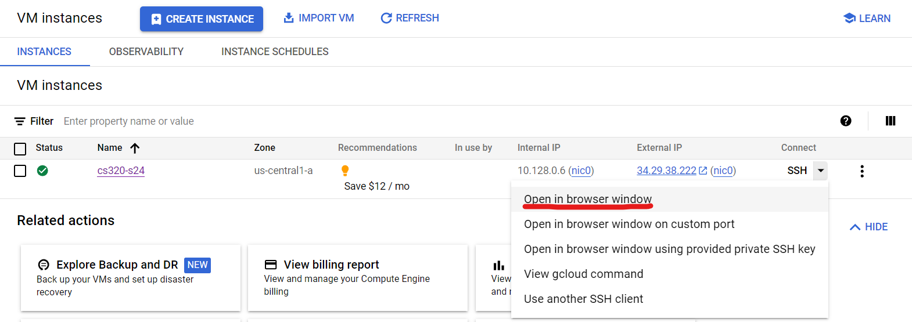
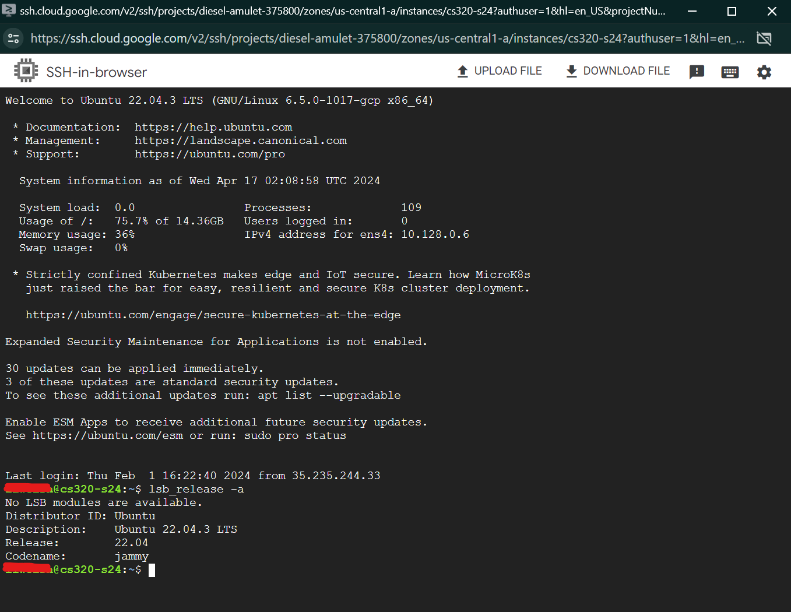

# Connecting via Cloud Console

**Caution:** If you use this option, it may complicate debugging of your VM if things go wrong. This method will create a different user on your VM if you also access through the other SSH method. Remember to share this if you are receiving help to debug your VM at any point during the course.

In the table of VM instances, click the arrow by "SSH" in the row for your virtual machine, and click "Open in browser window". 

When the window finally opens, run `lsb_release -a`.  If all is well,
it should show you what version of Ubuntu you're running (hopefully
22.04).  It should look something like this:

Congrats, you've created your first virtual machine with Linux
installed!  This is no small feat, and being able to do so in the
future in an invaluable career skill.
