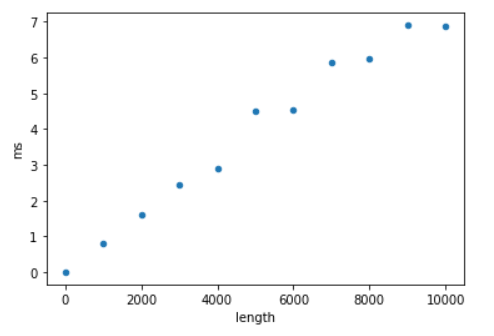

# Regression

This method randomly re-arranges the items in a list:
https://docs.python.org/3/library/random.html#random.shuffle.  The
longer the list, the longer it takes.

Lets see if we can predict how long it will take to shuffle one
million numbers by (1) measuring how long it takes to shuffle one to
ten thousand numbers, (2) fitting a LinearRegression model to the
time/size measures, and (3) predicting/extrapolating to one million.

Create this table (we'll soon fill in the millisecond column):

```python
import time, random
import pandas as pd
from sklearn.linear_model import LinearRegression

times_df = pd.DataFrame({"length": [i * 1000 for i in range(11)], "ms": None}, dtype=float)
times_df
```

Complete and test the following function so that it uses `time.time()`
to measure how long it takes to do the shuffle, then returns that
amount of time in milliseconds:

```python
def measure_shuffle(list_len):
    nums = list(range(list_len))
    t0 = ????
    random.shuffle(nums)
    t1 = ????
    return ????
```

Now use `measure_shuffle` to fill in the `ms` column from our table
earlier (replace `????` with the column names in `times_df`) and plot
the relationship.

```python
for i in times_df.index:
    length = int(times_df.at[i, "length"])
    times_df.at[i, "ms"] = measure_shuffle(length)

times_df.plot.scatter(x="????", y="????")
```



Now train a model on the measured times, and use that to predict how
long it will take to shuffle a million numbers:

```python
lr = LinearRegression()
lr.fit(times_df[[????]], times_df[????])
lr.predict([[1000000]])
```
**Notice:** 
- When we fit the model, the method takes 2 parameters, our predictors `times_df[[????]]` which is a 2D array (a DataFrame) and the column that we are trying to predict which is a 1D array (a Pandas Series). 
- Then, when we want to predict, we must provide our model with the same predictor variables as when we fit it. Here, we made a 2D array with just 1 value `[[1000000]]`, because we only have one column of predictors and we are only predicting for one measurement.
- This is the same process that we will use to fit and predict with any model that we create using sklearn. 

Call `measure_shuffle` with 1000000 to see how good your prediction
was.  When I did this, the model predicted 943.0 milliseconds, but it
actually took 887.6 milliseconds.  Not bad, considering we're
extrapolating to 100x larger than our largest measurement!

Note: LinearRegression worked well because `random.shuffle` uses an
O(N) algorithm.  Think about what would happen if you used a
LinearRegression to extrapolate the time it takes to do a non-O(N)
piece of work.  Or, better, replace `random.shuffle(nums)` with
`nums.sort()`, which as complexity O(N log N), as re-check how
accurate the predictions are.
