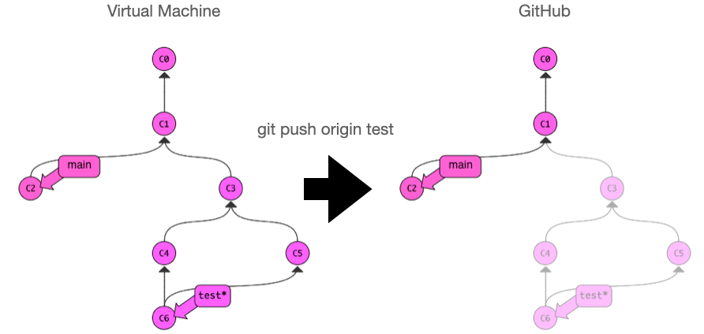
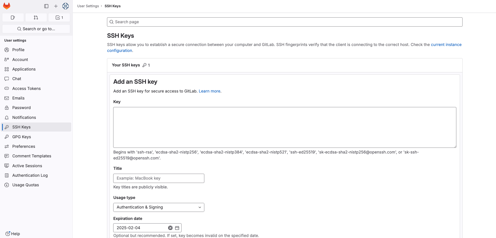
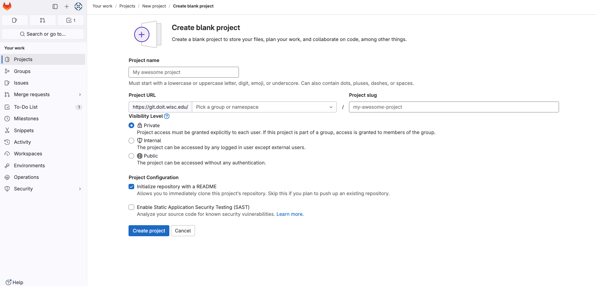
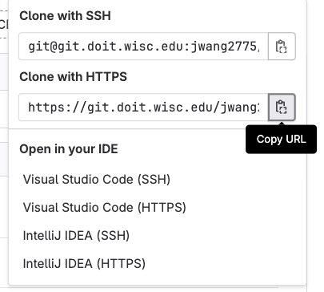

# GitLab

In this lab, you'll practice using git. You'll create your own repo, and push changes there.

## Background

A **repo** contains a bunch of commits, and usually a few branches to
label different commits.  In order to support collaboration and
offline work, it is common to have multiple copies of the same repo.
For example, say there is a team of 3 people working on an open-source
project.  There will probably be six copies of the repo: one on each
person's laptop or virtual machine and one on each person's GitLab
account (with one of the GitLab ones being the primary home for the
code).

Various git commands and tools can be used to syncronize the copies.
For example, running `git push origin test` uploads the `test` branch,
and all the associated commits, to `origin`:



`origin` is an example of a **remote**, a shorthand name to use instead
of a full URL for a repo somewhere else (like GitLab).  When you
`clone` a repo from GitLab, you automatically get a remote called
`origin`, but you can setup more yourself.

`clone` is a one-time thing to make a new copy of a GitLab repo on
your computer and download all the commits/branches/etc.  If new
changes are made on the GitLab repo, you can instead run `git pull` to
download these without creating a whole new copy of the repo.

In addition to these three general git commands (**clone**, **pull**, **push**),
GitLab has two key tools for syncing repos:

* **fork**: copy somebody else's GitLab repo to a new repo (called a fork) on your account
* **pull request**: ask somebody to bring some new code you uploaded to your fork back into the main repo

Consider a concrete example of how to use all these commands.  Say you find a bug in `pandas`, fix it, and want to share the fix back.  You might do the following:

1. Find the pandas repo on GitLab
2. Clone the pandas repo to a copy on your computer
3. Fork the pandas repo to a copy in your own GitLab account
4. Make the change to the copy on your computer
5. Add a remote so that you can push from your computer to your GitLab fork
6. Do a push to upload your changes from your computer to your fork
7. Do a pull request from your fork to the main pandas repo
8. Somebody in charge of main repo will consider your changes, and probably (a) click a button on GitLab to incorporate your changes, or (b) give you feedback to make the code better first, in which case you go back to step 4

## Step 1: SSH Keys

These steps are similar to the previous lab.  There, we created SSH keys
on your laptop, allowing you to connect laptop=>VM.  Now, we're
creating SSH keys on your VM, allowing you to connect VM=>GitLab.

Connect via SSH to your VM.

Run `ssh-keygen` on your VM and repeatedly hitting `ENTER` to accept
all the defaults (including an empty password).

Run the following and **copy** the output:

```
cat ~/.ssh/id_rsa.pub
```

Select "New SSH key".

Name the key "cs320-vm" (or whatever you like, really) and paste the
contents of `id_rsa.pub` to the "Key" box.



Click "Add SSH Key" to finish adding it.

## Step 2: Create a Repo

Create a project repo called
"cs320-lab2". 

**Note:** The group field in the Project URL corresponds to your NETID.



This should create a project. Go to that project. Click the blue **Code** button, and then copy the link associated with **https**. 




Then paste and run `git clone https://git.doit.wisc.edu/NETID/cs320-lab2.git [what you copied above]`. 
You will then be asked to enter a username and a password. 
- The username will be your NETID, and the password will be the personal access token, generated by GitLab.
- If you have not created this token yet, you can quickly make one now, [here](./token.md)

If prompted, you can configure your username/email:

```
git config --global user.name "your_gitLab_username"
git config --global user.email "your_email"
```

Refresh the GitLab page for your repo at https://git.doit.wisc.edu/YOUR_NETID/cs320-lab2 (with your NET ID instead of "YOUR_NETID").  You should now see the first commit.

Make another change to README.md on your computer (for example, say
"hello world"), push those changes to GitLab, then refresh the page.
Like this (one step at a time): 

```
nano README.md # make some changes, then save
git status
git add README.md 
git commit -m 'say hello'
git push
```

Keep in mind `nano` is an in-terminal text editor so you can only use
keyboard shortcuts (not the mouse). Do control-O to write the file.
"^" means CONTROL, and the bottom of the screen should provide hints.