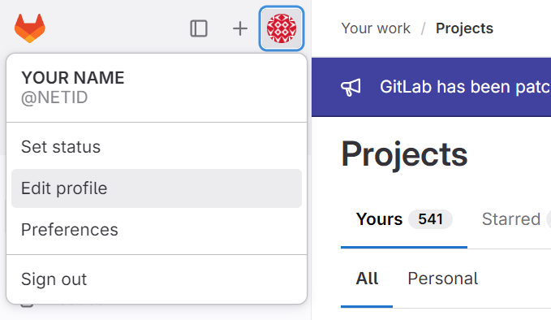
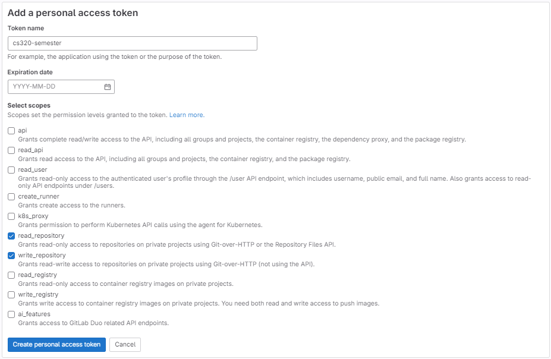
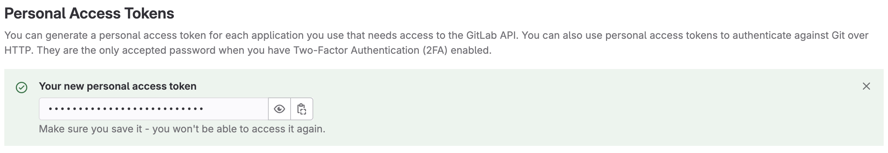

### How do you generate a personal access token?

GitLab will either use an SSH key or a personal access token to verify your identity. Unfortunately, for security reasons, using SSH keys under the WISC domain of GitLab requires connecting to the campus VPN, which is hard to set up on your VM. Therefore, we will use a personal access token.

1. Go to `Edit profile` under your user avatar in the upper left corner.

2. Click `Add new token` under `Access Tokens`. Then create the token with read repository and write repository permissions:

3. Copy-paste the token and save it at somewhere safe so you can use it when pull and push on your forked repository. You will be using this code frequently.

