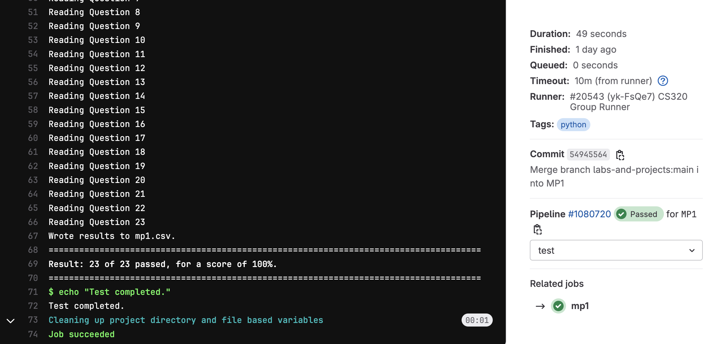

# Machine Project 1: Review

## Overview

This machine project focuses on review of concepts needed to succeed in this course; it is
designed to get familiar with Python basics (or review them if you
took 220).

<hr/>

## Learning Objectives

During this machine project, students will:
- Write code to control the flow of execution using loops, functions, and if statements.
- Extract values from Python state (variables, data structures, etc.) including nested lists and dictionaries.
- Use the `pandas` package to read CSV files into DataFrames and analyze and plot the resulting data.

<hr/>

## VM Setup

Make sure to complete [Lab 1](../../labs/Lab1/README.md) before starting this, as it must be done on your
virtual machine.

1. SSH to your virtual machine by running `ssh USERNAME@IP_ADDRESS`

If you don't recall these from lab, you can find your [username](https://console.cloud.google.com/compute/metadata/sshKeys)
and [External IP address](https://console.cloud.google.com/compute/instances) in Google's
console.

2. Please refer to the [git-workflows](../../git-workflows/README.md/#getting-started-with-your-vm) for how to clone your personal GitLab repository. 

3. Go to `http://YOUR_IP_ADDRESS:2020/` in the browser (sign in, if prompted)

Jupyter should still be running from when you started it during lab, but if it's not, you can start it again with the following:

`nohup python3 -m jupyterlab --no-browser --ip=0.0.0.0 --port=2020 &`

<hr/>

## Project Structure
This project consists of an **Individual Part** worth 100%.

* **Individual Part:**
    * Part 1: Python Control Flow _(`mp1.ipynb`)_
    * Part 2: Interacting with Python State _(`mp1.ipynb`)_
    * Part 3: Data Science using `pandas` _(`mp1.ipynb`)_

<hr/>

## Testing

Your notebook should follow this format to be compatible with the tester:

```python
# import statements in the top cell
```

```python
#Q1
some code
output answer
```

```python
#Q2
some code
output answer
```

For example, if question 0 was "What is 10 - 3?", our cell would look like this:

```python
#Q0
answer = 10 - 3
answer # Notice that we just put the variable name -- don't print it or you will get an error
```

To test your answers, do the following:
1. **Restart Kernel:** Do a "Kernel" > "Restart Kernel & Run All Cells" in your notebook
2. **Save Notebook:** Once the notebook finished running, do "File" > "Save Notebook"
3. **Navigate to Project:** In terminal, navigate to your `mp1` directory
4. **Run Tester:** Run `python3 tester.py` and work on fixing any issues

**Notes**: 
* ***Do not*** include the question, or anything else after "#Q__" or else we may be unable to
parse your notebook.
* **It is okay to add additional cells outside of these, but only questions that have "#Q__" as
the first line will be graded.**
* You need to do a "Restart Kernel & Run All Cells" each time you make modifications to your
notebook. Wait for all cells to run before saving. If you get an error that says "Expected
execution count XX but found YY", you need to do this again.

<hr/>

## Submission

**Required Files**
* `mp1.ipynb`
* `Q21.pkl`: graph object generated by `mp1.ipynb`
* `Q22.pkl`: graph object generated by `mp1.ipynb`
* `Q23.pkl`: graph object generated by `mp1.ipynb`

To submit the machine project, make sure that you have followed the instructions for "submitting a machine project"
in the [git-workflows](../../git-workflows/README.md/#submitting-a-machine-project) document for the required file(s) above.

When following the submission instructions from above, the final output should look similar to this in GitLab:



If you do not know how to get to this screen, review the link above. If you are having issues, please come to office hours.

<hr/>

## Important Notes
1. This whole assignment is to be done **individually**. That means, you are only allowed to seek help from CS 320 course staff (peer mentors, TAs, and the instructor). You may not receive help from anyone else.
2. Hardcoding of any kind or trying to "cheat" the autograder **will be penalized heavily and can also result in 0 marks for all the projects**. If you are confused about your code, please reach out to the teaching staff before submission.

<hr/>

## **Follow the instructions in `mp1.ipynb` to complete the project**