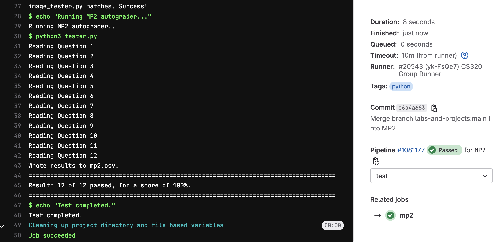

# Machine Project 2: Webscraping & Data Analysis, Git Analysis, and Benchmarking

## Overview

This machine project will help studens review some basic HTML concepts from CS 220, check their understanding of the structure of Git repositories, and perform simple benchmarking analysis to compare and measure the performance of code.

## Learning Objectives

During this machine project, students will:
- Review some basic webscraping concepts and analyze the gathered data
- Write code to analyze the history of a git project.
- Measure performance of different functions by benchmarking.

## Project Structure
This project consists of an **Individual Part** worth 100%.

* **Individual Part:**
    * Part 1: HTML Review _(`mp2.ipynb`)_
    * Part 2: Project History Analysis _(`mp2.ipynb`)_
    * Part 3: Benchmarking _(`mp2.ipynb`)_

## Testing

To test your answers, do the following:
1. **Restart Kernel:** Do a "Kernel" > "Restart Kernel & Run All Cells" in your notebook
2. **Save Notebook:** Once the notebook finished running, do "File" > "Save Notebook"
3. **Navigate to Project:** In terminal, navigate to your `mp2` directory
4. **Run Tester:** Run `python3 tester.py` and work on fixing any issues

**Notes**: 
* ***Do not*** include the question, or anything else after "#Q__" or else we may be unable to
parse your notebook.
* **It is okay to add additional cells outside of these, but only questions that have "#Q__" as
the first line will be graded.**
* You need to do a "Restart Kernel & Run All Cells" each time you make modifications to your
notebook. Wait for all cells to run before saving. If you get an error that says "Expected
execution count XX but found YY", you need to do this again.

## Submission

**Required Files**
* `mp2.ipynb`
* `Q10.pkl`: graph object generated by `mp2.ipynb`
* `Q11.pkl`: graph object generated by `mp2.ipynb`
* `Q12.pkl`: graph object generated by `mp2.ipynb`

To submit the machine project, make sure that you have followed the instructions for "submitting a machine project"
in the [git-workflows](../../git-workflows/README.md/#submitting-a-machine-project) document for the required file(s) above.

When following the submission instructions from above, the final output should look similar to this in GitLab:

If you do not know how to get to this screen, review the link above. If you are having issues, please come to office hours.

## Important Notes
1. This whole assignment is to be done **individually**. That means, you are only allowed to seek help from CS 320 course staff (peer mentors, TAs, and the instructor). You may not receive help from anyone else.
2. Hardcoding of any kind or trying to "cheat" the autograder **will be penalized heavily and can also result in 0 marks for all the projects**. If you are confused about your code, please reach out to the teaching staff before submission.

## **Follow the instructions in `mp2.ipynb` to complete the project**
