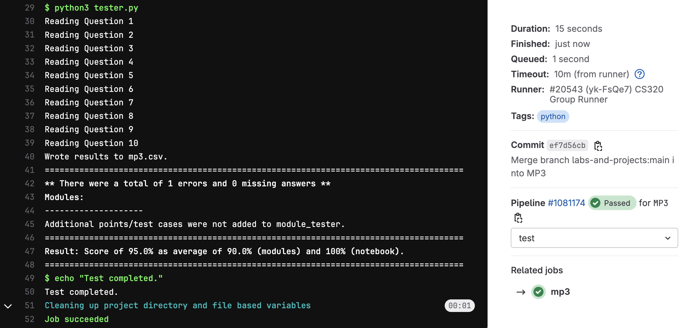

# Machine Project 3: Loan Analysis

## Overview

Sadly, there is a long history of lending discrimination based on race
in the United States.  Lenders have literally drawn red
lines on a map around certain neighborhoods where they would not
offer loans, based on the racial demographics of those neighborhoods
(read more about redlining here: https://en.wikipedia.org/wiki/Redlining).
In 1975, congress passed the Home Mortgage Disclosure Act (HDMA) to
bring more transparency to this injustice
(https://en.wikipedia.org/wiki/Home_Mortgage_Disclosure_Act).  The
idea is that banks must report details about loan applications and
which loans they decided to approve.

The public HDMA dataset spans all the states and many years, and is documented here:
* https://www.ffiec.gov/hmda/pdf/2020guide.pdf
* https://cfpb.github.io/hmda-platform/#hmda-api-documentation

In this machine project, we'll analyze every loan application made in Wisconsin in
2020.

## Learning Objectives

There's a lot of new stuff here, and students have often reported back
that P3 is the hardest of the semester, so we encourage you to start
early.

During this machine project, students will:
- Practice with the Object-Oriented Programming (OOP) paradigm by creating custom classes for analyzing loan data.
- Work with analyzing large datasets.
- Create efficient data structures for data storage and lookup.
- Develop custom tests to ensure code quality.
- Write their own Python modules that can be used in other notebooks or scripts.

## Project Structure
This project consists of a **Group Part** worth 75% and an **Individual Part** worth 25%.
* **Group Part:**
    * Part 1: Loan Classes _(`loans.py`)_
    * Part 2: Binary Search Tree _(`search.py`)_
    * Part 3: 'Merchants Bank of Indiana' Analysis _(`mp3.ipynb`)_
* **Individual Part:**
    * Part 4: 'Landmark Credit Union' Analysis _(`mp3.ipynb`)_

## Testing

To test your answers, do the following:
1. **Restart Kernel:** Do a "Kernel" > "Restart Kernel & Run All Cells" in your notebook
2. **Save Notebook:** Once the notebook finished running, do "File" > "Save Notebook"
3. **Navigate to Project:** In terminal, navigate to your `mp3` directory
4. **Run Tester:** Run `python3 tester.py` and work on fixing any issues

**Notes**: 
* ***Do not*** include the question, or anything else after "#Q__" or else we may be unable to
parse your notebook.
* **It is okay to add additional cells outside of these, but only questions that have "#Q__" as
the first line will be graded.**
* You need to do a "Restart Kernel & Run All Cells" each time you make modifications to your
notebook. Wait for all cells to run before saving. If you get an error that says "Expected
execution count XX but found YY", you need to do this again.

## Submission

**Required Files**
* `mp3.ipynb`
* `loans.py`: A Python module (.py file) containing classes for creating `Applicant`, `Loan`, and `Bank` objects. (Will start in lab)
* `search.py`: A Python module (.py file) containing classes for creating `Node`, and `BST` objects. (Will start in lab)
* `module_tester.py`: A Python script (.py file) for testing the two modules we wrote above.
* `Q6.pkl`: graph object generated by `mp3.ipynb`
* `Q7.pkl`: graph object generated by `mp3.ipynb`
* `Q8.pkl`: graph object generated by `mp3.ipynb`

To submit the machine project, make sure that you have followed the instructions for "submitting a machine project"
in the [git-workflows](../../git-workflows/README.md/#submitting-a-machine-project) document for the required file(s) above.

When following the submission instructions from above, the final output should look similar to this in GitLab:

**Note**: When we ran the autograder on this demonstration, we **did not** add in the additional tests. Make sure
that you add in the additional tests in `module_tester.py` to achieve full marks.

If you do not know how to get to this screen, review the link above. If you are having issues, please come to office hours.

## Important Notes:
1. Hardcoding of any kind or trying to "cheat" the autograder **will be penalized heavily and can also result in 0 marks for all the projects**. If you are confused about your code, please reach out to the teaching staff before submission.

## **Follow the instructions in `mp3.ipynb` to complete the project**