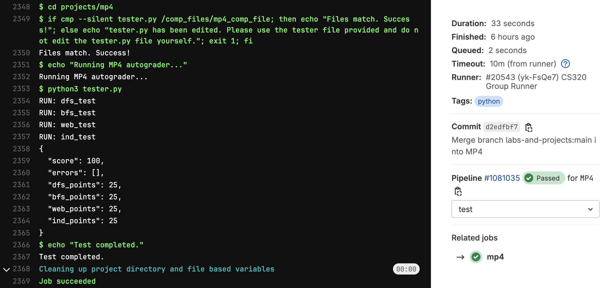
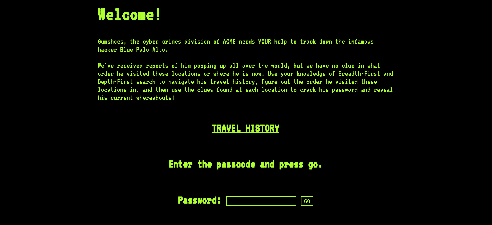

# Machine Project 4: Graph Traversal and Web-Scraping

## Overview

In this machine project, we will continue to build on the OOP principles from last machine project.
To start, we will work on building a parent class for traversing different forms of
graphs called `GraphSearcher`. We will build several different children classes that
inherit from the `GraphSearcher` class that allow us to traverse through **different
forms** of graphs. Finally, we will learn some web-scraping techniques in *Selenium*
that will allow us to get information from a dynamically loaded website and complete
a scavenger hunt using the information we acquire.

<hr/>

## Learning Objectives

During this machine project, students will:
- Practice with the Object-Oriented Programming (OOP) paradigm by creating custom
classes for traversing different graphs.
- Create different graph structures using matrices, files, and a website.
- Scrape dynamically loaded websites using selenium.

<hr/>

## Setup

Before you begin working on the project make sure you run the following commands from the `projects` directory:

```bash
cd mp4 # navigate to the project directory
git checkout main # switch to the main branch
git pull # pull remote changes to your local branch
git checkout MP4 # switch to MP4 branch
git merge main # merge changes from main to MP4
```

Once you run these commands, you should verify that you are on the `MP4` branch by running `git branch`, you should also be able to run `ls` to see that this machine project and all of its files are present. Additional instructions can be found in the [git-workflows](../../git-workflows/README.md/#starting-a-machine-project) document.

You are now ready to begin the machine project. Make sure that you add-commit-push your code as you go.

<hr/>

## Project Structure
This project consists of a **Group Part** worth 75% and an **Individual Part** worth 25%.
* **Group Part:**
    * Part 1: Parent Class and DFS on Matrices _(`scrape.py`)_
    * Part 2: BFS on Matrix and Files _(`scrape.py`)_
    * Part 3: Web Crawling _(`scrape.py`)_
* **Individual Part:**
    * Part 4: `reveal_secrets` function _(`scrape.py`)_

<hr/>

## Testing

Run `python3 tester.py` often and work on fixing any issues.

**Note**: while we are not collecting a notebook for this machine project, we recommend that you
create a `debug.ipynb` for debugging your different modules and classes as you work.
Remember that adding the following two lines below your imports will allow you to
reload your modules **without** needing to "Restart Kernel & Run All Cells" after each
change that you make:

```python
%load_ext autoreload
%autoreload 2
```

So in your notebook, you should have a cell like this:

```python
import scrape
... # other imports

%load_ext autoreload
%autoreload 2
```

<hr/>

## Submission

**Required Files**
* `scrape.py`: A Python module containing the classes `GraphSearcher` (parent class),
`MatrixSearcher` (child class), `FileSearcher` (child class), `WebSearcher` (child class), and `reveal_secrets` which is a function you will create later.

To submit the machine project, make sure that you have followed the instructions for "submitting a machine project"
in the [git-workflows](../../git-workflows/README.md/#submitting-a-machine-project) document for the required file(s) above.

When following the submission instructions from above, the final output should look similar to this in GitLab:



If you do not know how to get to this screen, review the link above. If you are having issues, please come to office hours.

<hr/>

## Important Notes:
1. Hardcoding of any kind or trying to "cheat" the autograder **will be penalized heavily and can also result in 0 marks for all the projects**. If you are confused about your code, please reach out to the teaching staff before submission.

<hr/>

## **Follow these instructions to complete MP4**

<hr/>

# Group Part (75%)

For this portion of the machine project, you may collaborate with your group members in any way (including looking at group members' code). You may also seek help from CS 320 course staff (peer mentors, TAs, and the instructor). You **may not** seek or receive help from other CS 320 students (outside of your group) or anybody else outside of the course.

## Part 1: Parent Class `GraphSearcher` and DFS on Matrices (`MatrixSearcher`)
> 📄 **Work in:** [`scrape.py`](scrape.py)

Complete [scrape.py](../../labs/Lab5/README.md) from Lab 5 if you haven't already done so.

## Part 2: BFS on Matrix (`MatrixSearcher`) and Files (`FileSearcher`)
> 📄 **Work in:** [`scrape.py`](scrape.py)

Add a `bfs_search` method to the base searcher `GraphSearcher`.  It should behave the same as
`dfs_search`, but use the BFS algorithm instead of DFS.  The
difference will be evident at the end if someone looks at the `.order`
attribute.

Note that without changing `MatrixSearcher`, it now supports both DFS
and BFS search since it inherits from `GraphSearcher`.

You could test your bfs implementation on `MatrixSearcher` by pasting the sample code to a `debug.ipynb` notebook in your `mp4` directory.
```python
import pandas as pd
import scrape

df = pd.DataFrame([
    [0,1,0,1],
    [0,0,1,0],
    [0,0,0,1],
    [0,0,1,0],
], index=["A", "B", "C", "D"], columns=["A", "B", "C", "D"])

m = scrape.MatrixSearcher(df)
m.bfs_search(????)
m.order
```
From "A", for example, `m.order` should be `['A', 'B', 'D', 'C']`.  Look
back at the picture you drew of the graph and make sure you're getting
what you expect when starting from other nodes.


### `FileSearcher` Class

Add another class, `FileSearcher`, which also inherits from
`GraphSearcher`.  Your job is to implement the three methods `__init__`, `visit_and_get_children`, and `concat_order` and inherit other methods.
1. `__init__`: The constructor of `FileSearcher` which does not take additional parameter besides the instance itself.
2. `visit_and_get_children`: Visit the file to record its value and then return its
children as defined below.
4. `concat_order`: concatenate the values in `self.order` to a string. (Ex. if
`self.order = ["B", "A", "D", "G", "E", "R", "S"]` for a `FileSearcher` object named
`fs`, then calling `fs.concat_order()` will return `"BADGERS"`).

The `FileSearcher` will be a class for traversing graphs that are stored in files. As
such, each node will be a file. These nodes can be found in the `file_nodes` directory.
For example, the node `1.txt` contains this:

```
M
2.txt,4.txt
```

The first line represents the **value** for this node. In this case, the value for
`1.txt` is "M". The second line is the **children** of this node, separated by commas.
In this case, the children of `1.txt` are `2.txt` and `4.txt`.

All the files will have two lines like this, with a value on the first
line, and a comma-separated list of children on the second line.

The `visit_and_get_children` method should read a node file, record its value in `self.order` and return a list of children.
The `concat_order` method should return all the values concatenated together.  

You could test this in your debug.ipynb notebook.:

```python
import scrape
fs = scrape.FileSearcher()
print(fs.visit_and_get_children("1.txt"), fs.order, fs.concat_order())
```

Expected result: `['2.txt', '4.txt'] ['M'] M`.

## Part 3: Web Crawling (`WebSearcher`)
> 📄 **Work in:** [`scrape.py`](scrape.py)

**Don't start this part until we learned about Selenium in class and how
to run it in "headless" mode.**

**Note**: launching many web browsers via code can quickly eat up
all the memory on your VM.  You can run the `htop` command to see
how much memory you have (hit "q" to quit when done).  If you're low
on memory (you might notice your VM being sluggish), you can run
`pkill -f -9 chromium` shutdown all browser instances hanging around
in the background.

### Launching the Website

You'll be scraping a website implemented as a web application built
using the Flask framework (you don't need to know flask for this
machine project, though you'll learn it soon and get a chance to build your
own website in the next machine project).  In an SSH session, run the
following to launch it:

```
python3 application.py
```

Then, open `http://<YOUR-VM-IP>:5000` in your web browser. **Do not**
use the IP address that is printed to console in the ssh session (it
won't work).  It should look like this:



If you click "TRAVEL HISTORY", you'll enter a graph of pages, each
with a table fragment.  Your job is to search the graph (using the
search methods you wrote earlier), collect all the table fragments,
and concatenate them into one big DataFrame.

### `WebSearcher` Class

The next class that we will add is the `WebSearcher` class. This class will
be used for traversing graphs that are defined using webpages. More information
on the value for one of these nodes and the children can be found below.

Write a `WebSearcher` class that inherits from `GraphSearcher`.  The
constructor should take a Chrome webdriver object as a parameter so
that it is possible to create `WebSearcher` object with `ws =
scrape.WebSearcher(some_driver)`.

The `visit_and_get_children` method of `WebSearcher` should treat the node as a URL.  It
should use the webdriver to visit that page and return the URLs of
other pages to which the visited page has hyperlinks.  See `web_test`
in the tester for examples of how it should behave. In other words, the
children of a node will be the other URLs that are found on this node's 
page when we visit it.

The `visit_and_get_children` method should also use [this pandas function](https://pandas.pydata.org/pandas-docs/stable/reference/api/pandas.read_html.html) to read any table
fragments on a visited page and store them somewhere (for example, in
an attribute)

`WebSearcher` should have a `table()` method that
[concatenates](https://pandas.pydata.org/docs/reference/api/pandas.concat.html)
all the fragments in the order they were visited and returns one big
DataFrame.  Use `ignore_index=True` when concatenating. **Be careful** because there
may be additional tables that we don't actually want. In these cases, we may need to
slice the list to extract only the list that we want.

To locate elements on a page Selenium has the `find_element` and `find_elements` methods which can be used with the `By` class to locate the element of your choice. For example, if you are trying to find all the `a` tags in your html page:

```python
from selenium.webdriver.common.by import By

driver.find_element(By.TAG_NAME, 'a')
```

You will need to incorporate these into your scripts while trying to search for tags, names, IDs, etc. More information on how to locate elements using Selenium can be found [here](https://selenium-python.readthedocs.io/locating-elements.html)

**Important**: In recent versions of Selenium, the `find_element(...)` method has undergone
changes that no longer allow for calls like `find_element_by_id(...)`. Instead, it is **important**
that you use the method described above, otherwise you will face errors.

### Debugging

You can use the following code snippet to initialize the driver to use while testing.

```python
import os
from selenium.webdriver.chrome.options import Options
from selenium import webdriver

driver = None

def browser():
    global driver

    if not driver:
        os.system("pkill -f -9 chromium")
        options = Options()
        options.add_argument("--headless=new")
        options.add_argument('--no-sandbox')
        options.add_argument('--disable-dev-shm-usage')
        driver = webdriver.Chrome(options=options)
    return driver
```

Make sure that it works by running the following code snippet (be sure to replace `YOUR_VM_IP`!):

```python
driver = browser()

# TODO: fill the value of VM_IP as your VMs IP address
VM_IP = ''
start_url = f"http://{VM_IP}:5000/Node_1.html"

s = scrape.WebSearcher(driver)
print(s.visit_and_get_children(start_url))

s = scrape.WebSearcher(driver)
s.bfs_search(start_url)

print(s.table())

driver.close()
```

Expected output:

```
['http://YOUR_VM_IP:5000/Node_2.html', 'http://YOUR_VM_IP:5000/Node_4.html']
    clue   latitude   longitude                          description
0      1  43.089034  -89.416128              Picnic Point in Madison
1      7  38.105507  126.910613               Silver Beach in Hawaii
2      1  65.044901  -16.712836  Shore of a Volcanic Lake in Iceland
3      3  48.860945    2.335773                  The Louvre in Paris
4      5  37.434183 -122.321990      Redwood forest in San Francisco
5      8  51.180315   -1.829659                 Stonehenge in the UK
6      2  27.987586   86.925002                 Mt. Everest in Nepal
7      4  34.134117 -118.321495                 Hollywood Sign in LA
8      5  38.655100   90.061800                 Cahokia Mounds in IL
9      9  40.748400   73.985700          Empire State Building in NY
10     4  29.975300   31.137600        Great Sphinx of Giza in Egypt
11     1  47.557600   10.749800     Neuschwanstein Castle in Germany
12     5  38.624700   90.184800        The Gateway Arch in St. Louis
13     3  30.328500   35.444400                      Petra in Jordan
14     2  41.480800   82.683400                    Cedar Point in OH
15     6  43.070010  -89.409450          Quick Trip on Monroe Street
```

If you get an error when running the above code that contains `ERR_CONNECTION_REFUSED`,
make sure that you are currently running the application using `python3 application.py`.

# Individual Part (25%)

For this portion of the machine project, you are only allowed to seek help from CS 320 course staff (peer mentors, TAs, and the instructor). You **may not** receive help from anyone else.

For part 4 of the machine project, you will be writing a function that will give us a password 
for the main page of the application. Upon entering this password, we will be able to
find a hidden location and picture. Our goal will be to extract the name of this
location and save an image of it that is also hidden behind the password.

## Part 4: `reveal_secrets` function
> 📄 **Work in:** [`scrape.py`](scrape.py)

Write a function (remember that functions aren't inside any class) in
`scrape.py` like the following:

```python
def reveal_secrets(driver, url, travellog):
    ...
```

The function should do the following:

1. Generate a password from the "clue" column of the `travellog` DataFrame.  For example, if `travellog` is the big DataFrame built **after doing BFS** (as shown earlier), the password will start with "171358..."
2. Visit `url` with the `driver`
3. Automate typing the password in the box and clicking "GO"
4. Wait until the page is loaded (perhaps with `time.sleep`)
5. Click the "View Location" button and wait until the result finishes loading
6. Save the image that appears to a file named 'Current_Location.jpg' (use the `requests` module to do the download, once you get the URL from selenium)
7. Return the current location that appears on the page (should be "CAMP RANDALL STADIUM")

**Hints for step 6:** jpeg files are a binary format (they don't contain text for a human to read).  You'll need to do some searching online to learn how to (a) download binary data and (b) write it to a file.  Remember to cite any code you copy/paste.  Here are some example Google searches you might start with to find how to do these things:

* "how to write bytes to a file in python"
* "how to fetch a binary file with python requests"
