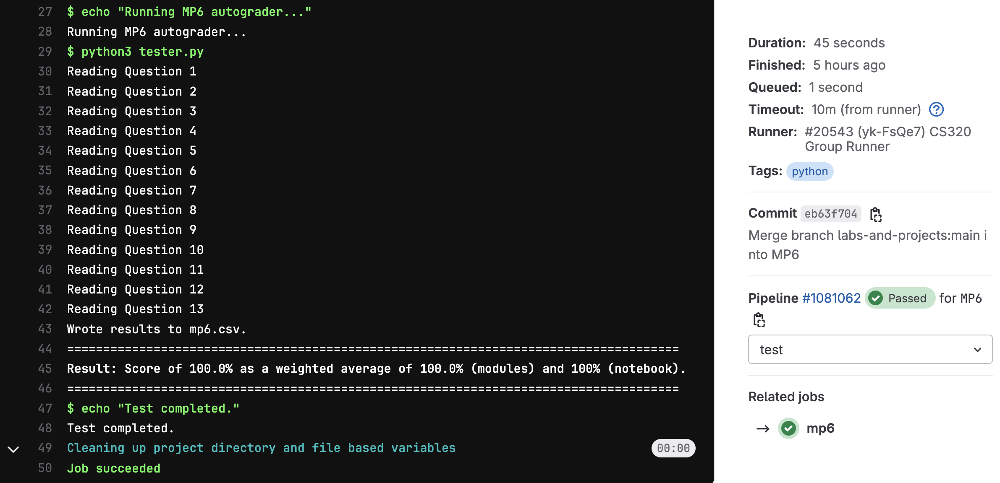

# Machine Project 6: EDGAR Web Logs

## Overview

In the US, public companies need to regularly file
various statements and reports to the SEC's (Securities and Exchange
Commission) EDGAR database.  EDGAR data is publicly available online;
furthermore, web requests to EDGAR from around the world are logged
and published.  EDGAR logs are huge.  Logs for *just one day* might be
about 250 MB compressed as a .zip (or 2 GB uncompressed!).

We'll develop tools to extract information from the filings stored in EDGAR (this will be done in a Python module, `edgar_utils.py`) and we'll use those tools to analyze user behavior in `mp6.ipynb`.

<hr/>

## Learning Objectives

During this machine project, students will:
- Work with large datasets from a zipfile using the Python `zipfile` module.
- Create a custom class for analyzing filing data using regular expressions
and other tools.
- Plot geographic data using the `geopandas` module.

<hr/>

## Project Structure
This project consists of a **Group Part** worth 75% and an **Individual Part** worth 25%.
* **Group Part:**
    * Part 1: `server_log.zip` analysis _(`mp6.ipynb`)_
    * Part 2: Creating `edgar_utils.py` module _(`edgar_utils.py`)_
    * Part 3: Using `edgar_utils.py` module _(`mp6.ipynb`)_
* **Individual Part:**
    * Part 4: Combining logs with documents _(`mp6.ipynb`)_

<hr/>

## Testing

To test your answers, do the following:
1. **Restart Kernel:** Do a "Kernel" > "Restart Kernel & Run All Cells" in your notebook
2. **Save Notebook:** Once the notebook finished running, do "File" > "Save Notebook"
3. **Navigate to Project:** In terminal, navigate to your `mp6` directory
4. **Run Tester:** Run `python3 tester.py` and work on fixing any issues

**Notes**: 
* ***Do not*** include the question, or anything else after "#Q__" or else we may be unable to
parse your notebook.
* **It is okay to add additional cells outside of these, but only questions that have "#Q__" as
the first line will be graded.**
* You need to do a "Restart Kernel & Run All Cells" each time you make modifications to your
notebook. Wait for all cells to run before saving. If you get an error that says "Expected
execution count XX but found YY", you need to do this again.

Be sure to run `python3 tester.py` regularly to estimate your grade. Similar to machine project 3, the tester will both check the results of the analysis in your notebook, and use `module_tester.py` to check your `edgar_utils.py` module.

<hr/>

## Submission

**Required Files**
* `mp6.ipynb`
* `edgar_utils.py`: A Python module (.py file) that will have a `Filing` class as well
as various functions for parsing filing information.
* `Q12.pkl`: graph object generated by `mp6.ipynb`
* `Q13.pkl`: graph object generated by `mp6.ipynb`

To submit the machine project, make sure that you have followed the instructions for "submitting a project"
in the [git-workflows](../../git-workflows/README.md/#submitting-a-machine-project) document for the required file(s) above.

When following the submission instructions from above, the final output should look similar to this in GitLab:



If you do not know how to get to this screen, review the link above. If you are having issues, please come to office hours.

<hr/>

## Data format

Take a look at the list of daily zips and CSV documentation on the EDGAR site:

- https://www.sec.gov/dera/data/edgar-log-file-data-set.html
- https://www.sec.gov/files/EDGAR_variables_FINAL.pdf

We have provided a `server_log.zip` file, which is a subset of the
records from `log20170101.zip`. Since you'll need to work with a lot of zipped files for this machine project, you'll want to know some command line techniques
to troubleshoot.

You can use `unzip` to view names of files in a zip file:

```
unzip -l server_log.zip
```

View the start of a file inside of a zip file (change "head" to "tail"
to see the end):

```
unzip -p server_log.zip rows.csv | head -n 5
```

The expected result is:

```
ip,date,time,zone,cik,accession,extention,code,size,idx,norefer,noagent,find,crawler,browser
104.197.32.ihd,2017-01-01,00:00:00,0.0,1111711.0,0001193125-12-324016,-index.htm,200.0,7627.0,1.0,0.0,0.0,10.0,0.0,
208.77.214.jeh,2017-01-01,00:00:00,0.0,789019.0,0001193125-06-031505,.txt,200.0,46327.0,0.0,0.0,0.0,10.0,0.0,
54.197.228.dbe,2017-01-01,00:00:00,0.0,800166.0,0001279569-16-003038,-index.htm,200.0,16414.0,1.0,0.0,0.0,10.0,0.0,
108.39.205.jga,2017-01-01,00:00:01,0.0,354950.0,0000950123-09-011236,-index.htm,200.0,8718.0,1.0,0.0,0.0,10.0,0.0,
```

Looking at the `cik`, `accession`, and `extention` fields tells you what web resource a user was requesting (in particular, each company has it's own `cik`):

```
ip,date,time,zone,cik,accession,extention,code,size,idx,norefer,noagent,find,crawler,browser,region
54.212.94.jcd,2017-01-01,03:31:36,0.0,1461219.0,0001209191-21-001287,-index.htm,301.0,243.0,1.0,0.0,1.0,10.0,0.0,,United States of America
...
```

**Note**: For this row, we can construct the following URL from `1461219.0`, `0001209191-21-001287`, and `-index.htm`: https://www.sec.gov/Archives/edgar/data/1461219/0001209191-21-001287-index.htm

Looking at this page and its source (as well as the source of the pages where your parser does not behave as expected) is highly recommended and will be very important later in the machine project.

We have already downloaded the docs for a subset of the requests in
`server_log.zip` for you and placed them in `docs.zip`. Note, however, that the file structure is slightly different than the URL above. The path in the zip to that file would be "1461219/0001209191-21-001287/-index.htm".

Note that by default reading inside a zip gives you bytes.  For your regex work, convert to a string using UTF-8 (like we have done for `check_output`).

<hr/>

## Conclusion

The EDGAR logs are supposedly anonymized (with the last three docs
left), but we can still tell where the users live and what they're
looking at.

 By connecting the filing information with the logs, we can learn a lot about the behavior of the investment firms which use the database - for example, we might learn which companies (or industries) a hedge fund might be considering investing in, and the extent to which it relies on automated vs manual research in its trading.

Others have used this same data to make good guesses
about what docs various hedge funds and others are looking at, then
correlate that with success.  For those interested in the nitty-gritty
details of what could be done with this data, take a look at this
early-stage work: [Hedge Funds and Public Information
Acquisition](https://papers.ssrn.com/sol3/papers.cfm?abstract_id=3127825).

<hr/>

## Important Notes:
1. Hardcoding of any kind or trying to "cheat" the autograder **will be penalized heavily and can also result in 0 marks for all the projects**. If you are confused about your code, please reach out to the teaching staff before submission.

<hr/>

## **Follow the instructions in `mp6.ipynb` to complete the project**
