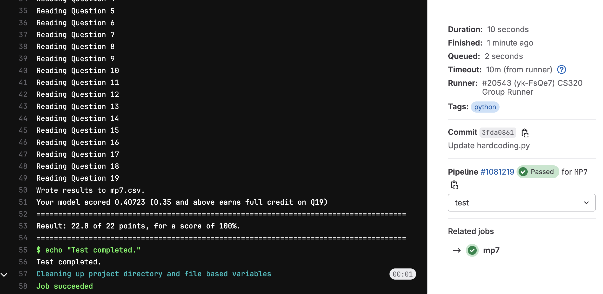

# Machine Project 7: Intro to Regression Models

## Overview

We will be making predictions about census data for Wisconsin using
regression models. You'll need to extract data from four files to
construct DataFrames suitable for training during this machine project:

* `counties.geojson` - population and boundaries of each county in Wisconsin
* `tracts.shp` - boundaries of each census tract (counties are subdivided into tracts)
* `counties_tracts.db` - details about housing units per tract
* `land.zip` - details about land use (farm, forest, developed, etc.)

## Learning Objectives

During this machine project, students will:
- Extract, transform, and load data from multiple data sources into one DataFrame for training
machine learning models.
- Analyze machine learning model performance using several different metrics and factoring in feature
impact on the model score.
- Plot geographical data using the `geopandas` module.

## Project Structure
This project consists of a **Group Part** worth 75% and an **Individual Part** worth 25%.
* **Group Part:**
    * Part 1: Predicting Population using Area _(`mp7.ipynb`)_
    * Part 2: Predicting Population using Housing Units _(`mp7.ipynb`)_
    * Part 3: Land Use Features _(`mp7.ipynb`)_
* **Individual Part:**
    * Part 4: Feature Analysis _(`mp7.ipynb`)_
    * Part 5: Model Creation and Analysis _(`mp7.ipynb`)_

## Testing

To test your answers, do the following:
1. **Restart Kernel:** Do a "Kernel" > "Restart Kernel & Run All Cells" in your notebook
2. **Save Notebook:** Once the notebook finished running, do "File" > "Save Notebook"
3. **Navigate to Project:** In terminal, navigate to your `mp7` directory
4. **Run Tester:** Run `python3 tester.py` and work on fixing any issues

**Notes**: 
* ***Do not*** include the question, or anything else after "#Q__" or else we may be unable to
parse your notebook.
* **It is okay to add additional cells outside of these, but only questions that have "#Q__" as
the first line will be graded.**
* You need to do a "Restart Kernel & Run All Cells" each time you make modifications to your
notebook. Wait for all cells to run before saving. If you get an error that says "Expected
execution count XX but found YY", you need to do this again.

## Submission

**Required Files**
* `mp7.ipynb`
* `Q2.pkl`: graph object generated by `mp7.ipynb`
* `Q12.pkl`: graph object generated by `mp7.ipynb`
* `Q14.pkl`: graph object generated by `mp7.ipynb`
* `Q16.pkl`: graph object generated by `mp7.ipynb`
* `Q17.pkl`: graph object generated by `mp7.ipynb`

To submit the machine project, make sure that you have followed the instructions for "submitting a machine project"
in the [git-workflows](../../git-workflows/README.md/#submitting-a-machine-project) document for the required file(s) above.

When following the submission instructions from above, the final output should look similar to this in GitLab:

If you do not know how to get to this screen, review the link above. If you are having issues, please come to office hours.

## Important Notes:
1. Hardcoding of any kind or trying to "cheat" the autograder **will be penalized heavily and can also result in 0 marks for all the projects**. If you are confused about your code, please reach out to the teaching staff before submission.

## **Follow the instructions in `mp7.ipynb` to complete the project**